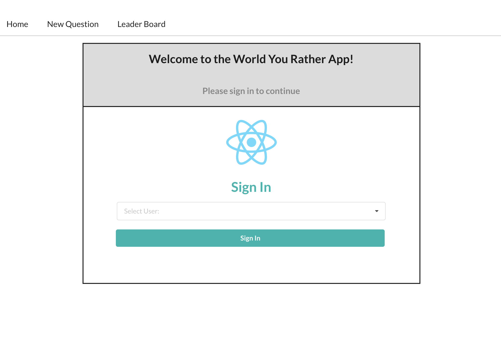
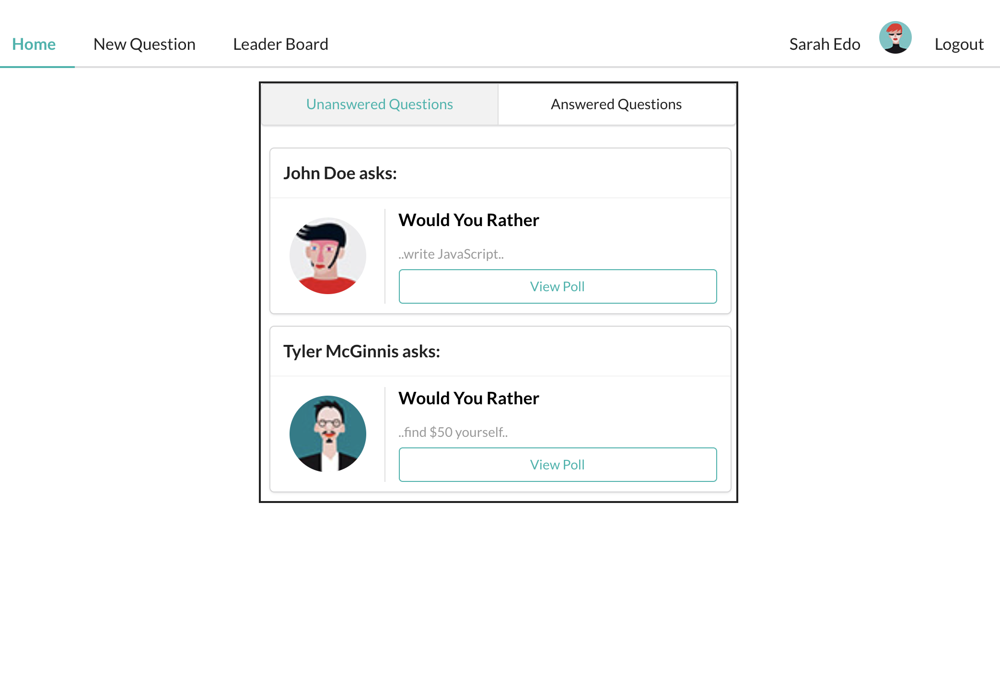
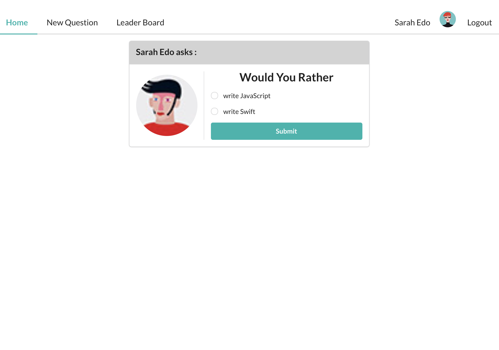
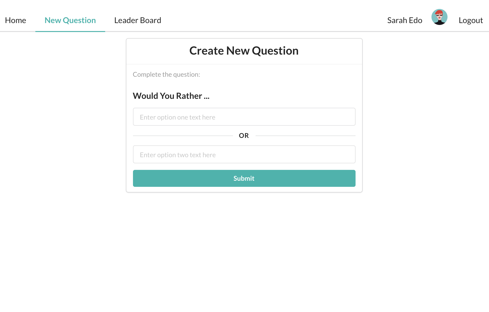
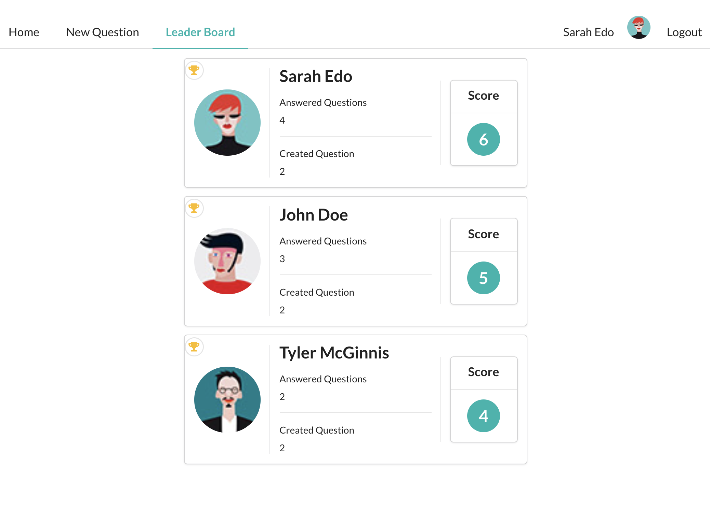

# Would-You-Rather App

[Would-You-rather](https://github.com/hikmanisyariful/would-you-rather/tree/master) is a web app that be built with using create-react-app and Redux for managing the state. This app lets a user play the `"Would You Rather?"` game.

# Quickstart

## Install

In the project directory, you can run:

```
$ npm install
```

The command going to install depedencies package managers in `package.json` file

```
{
  "name": "would-you-rather",
  "version": "0.1.0",
  "private": true,
  "dependencies": {
    "@testing-library/jest-dom": "^5.14.1",
    "@testing-library/react": "^11.2.7",
    "@testing-library/user-event": "^12.8.3",
    "react": "^17.0.2",
    "react-dom": "^17.0.2",
    "react-redux": "^7.2.5",
    "react-router": "^5.2.1",
    "react-router-dom": "^5.3.0",
    "react-scripts": "4.0.3",
    "redux": "^4.1.1",
    "redux-thunk": "^2.3.0",
    "semantic-ui-css": "^2.4.1",
    "semantic-ui-react": "^2.0.3",
    "styled-components": "^5.3.1",
    "web-vitals": "^1.1.2"
  }
```

and then

```
$ npm start
```

Runs the app in the development mode.\
Open [http://localhost:3000](http://localhost:3000) to view it in the browser.

---

## API

[Fake API](https://github.com/hikmanisyariful/would-you-rather/tree/master/src/utils) used to do as server in the App. Please look at `src/utils/READ.me`

---

## Routes

`/`



`/questions`



`/questions/:question_id`



`/add`



`/leaderboard`



## Learn More

You can learn more in the [Create React App documentation](https://facebook.github.io/create-react-app/docs/getting-started).

To learn React, check out the [React documentation](https://reactjs.org/).
